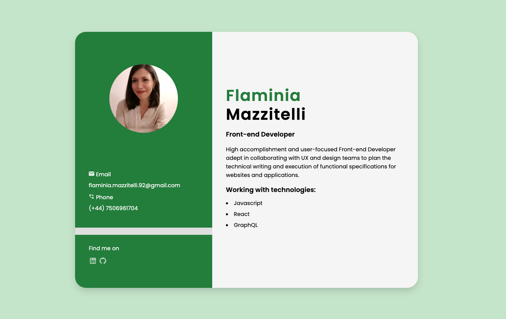

# Simple static business card project

## Table of Contents

- [Overview](#overview)
- [Built With](#built-with)

## Overview

<!-- TODO: Add a screenshot of the live project.
    1. Link to a 'live demo.'
    2. Describe your overall experience in a couple of sentences.
    3. List a few specific technical things that you learned or improved on.
    4. Share any other tips or guidance for others attempting this or something similar.
 -->

 Live website [here](https://prismatic-banoffee-e58a54.netlify.app/)

### Built With

<!-- TODO: List any MAJOR libraries/frameworks (e.g. React, Tailwind) with links to their homepages. -->
- React
- Sass

